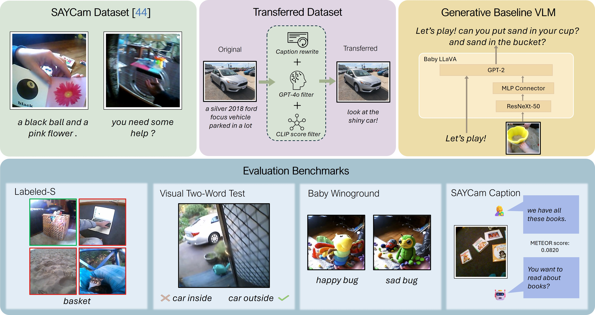

# BabyVLM: Data-Efficient Pretraining of VLMs Inspired by Infant Learning

[[Paper]](https://arxiv.org/abs/2504.09426) [[Project Page]](https://shawnking98.github.io/BabyVLM/)



[Shengao Wang](https://www.linkedin.com/in/shengao-wang-a259aa173/en)<sup>1</sup>,
[Arjun Chandra](https://www.linkedin.com/in/arjun-chandra2/)<sup>1</sup>,
[Aoming Liu](https://cs-people.bu.edu/amliu/)<sup>1</sup>
[Venkatesh Saligrama](https://venkatesh-saligrama.github.io/)<sup>1</sup>
[Boqing Gong](http://boqinggong.info/)<sup>1</sup>

<sup>1</sup>Boston University

### Abstract

Human infants rapidly develop visual reasoning skills from minimal input, suggesting that developmentally inspired pretraining could significantly enhance the efficiency of vision-language models (VLMs). Although recent efforts have leveraged infant-inspired datasets like SAYCam, existing evaluation benchmarks remain misaligned--they are either too simplistic, narrowly scoped, or tailored for large-scale pretrained models. Additionally, training exclusively on infant data overlooks the broader, diverse input from which infants naturally learn. To address these limitations, we propose BabyVLM, a novel framework comprising comprehensive in-domain evaluation benchmarks and a synthetic training dataset created via child-directed transformations of existing datasets. We demonstrate that VLMs trained with our synthetic dataset achieve superior performance on BabyVLM tasks compared to models trained solely on SAYCam or general-purpose data of the SAYCam size. BabyVLM thus provides a robust, developmentally aligned evaluation tool and illustrates how compact models trained on carefully curated data can generalize effectively, opening pathways toward data-efficient vision-language learning paradigms.

## Environment Setup

- For all hierarchical evaluations, please follow the official setups to install the conda environments seperately.

    - [LLaVA-OV](https://github.com/LLaVA-VL/LLaVA-NeXT)
    - [InternVL2.5&3](https://github.com/OpenGVLab/InternVL/tree/main)
    - [Qwen2.5-VL](https://github.com/QwenLM/Qwen2.5-VL)
    - [GPT-4o](https://github.com/openai/openai-python)
    - [OpenCLIP](https://github.com/mlfoundations/open_clip)
    - [SigLIP](https://huggingface.co/docs/transformers/main/en/model_doc/siglip)

- For LoRA-finetuning on Qwen2.5-VL-7B, we use the [Qwen2-VL-Finetune](https://github.com/2U1/Qwen2-VL-Finetune). Please run the following command to install the training conda environment:

    ```bash
    cd finetuning
    conda env create -f environment.yaml
    conda activate qwen_train
    pip install qwen-vl-utils
    pip install flash-attn --no-build-isolation
    ``` 

- For evaluation on general VQA benchmarks, please follow [VLMEvalKit](https://github.com/open-compass/VLMEvalKit) to install the environment.

- By default, we use [flash-attention](https://github.com/Dao-AILab/flash-attention) during all evaluations.

- Experiments are conducted on a wide range of GPUs, including A100, A40, L40, L40S and A6000 with CUDA 12.5.

## Data Preparation

### Step 1
We use four datasets to form 6 taxonomies.
Please download the image data from the following links and put them in the `data/images` directory.

- [Inaturalist2021](https://github.com/visipedia/inat_comp/tree/master/2021)
- [ImageNet-1K](https://huggingface.co/datasets/ILSVRC/imagenet-1k)
- [CUB-200-2021](https://www.vision.caltech.edu/datasets/cub_200_2011/)
- [Food-101](https://www.kaggle.com/datasets/dansbecker/food-101)

### Step 2


| **Taxonomy**            | **Path (Similar Choice)** |
|----------------------|------------|
| iNat21-Plant         | data/annotations/similar_choices/inat21_plantae_with_similar_choice.jsonl |
| iNat21-Animal        | data/annotations/similar_choices/inat21_animalia_with_similar_choice.jsonl |
| ImgNet-Animal        | data/annotations/similar_choices/imagenet_animal_with_similar_choice.jsonl |
| ImgNet-Artifact      | data/annotations/similar_choices/imagenet_artifact_with_similar_choice.jsonl |
| CUB-200-2021         | data/annotations/similar_choices/CUB200_with_similar_choice.jsonl |
| Food-101             | data/annotations/similar_choices/Food101_with_similar_choice.jsonl |

The annotation files with random choices are provided in the `data/annotations/random_choices` directory.

For each dataset file in the `data/annotations` directory and the `data/training/train_plant_img.json` file, please replace the image_path with your local path (a helper script is provided in `utils/replace_image_path.py`).

## Model Preparation

Please download the model checkpoints from the following links or just specify the model names when running scripts.


### VLMs

| **VLMs**            | **Source** |
|----------------------|------------|
| LLaVA-OV-7B          | [lmms-lab/llava-onevision-qwen2-7b-ov](https://huggingface.co/lmms-lab/llava-onevision-qwen2-7b-ov) |
| InternVL2.5-8B       | [OpenGVLab/InternVL2_5-8B](https://huggingface.co/OpenGVLab/InternVL2_5-8B) |
| InternVL3-8B         | [OpenGVLab/InternVL3-8B](https://huggingface.co/OpenGVLab/InternVL3-8B) |
| Qwen2.5-VL-7B        | [Qwen/Qwen2.5-VL-7B-Instruct](https://huggingface.co/Qwen/Qwen2.5-VL-7B-Instruct) |
| Qwen2.5-VL-32B       | [Qwen/Qwen2.5-VL-32B-Instruct](https://huggingface.co/Qwen/Qwen2.5-VL-32B-Instruct) |
| Qwen2.5-VL-72B       | [Qwen/Qwen2.5-VL-72B-Instruct](https://huggingface.co/Qwen/Qwen2.5-VL-72B-Instruct) |
| OpenCLIP             | [laion/CLIP-ViT-L-14-laion2B-s32B-b82K](https://huggingface.co/laion/CLIP-ViT-L-14-laion2B-s32B-b82K) |
| SigLIP               | [google/siglip-so400m-patch14-384](https://huggingface.co/google/siglip-so400m-patch14-384) |

### Original LLMs (OG LLMs)

| **OG LLMs**            | **Source** |
|----------------------|------------|
| Qwen2.5-Instruct-7B   | [Qwen/Qwen2.5-7B-Instruct](https://huggingface.co/Qwen/Qwen2.5-7B-Instruct) |
| Qwen2-Instruct-7B     | [Qwen/Qwen2-7B-Instruct](https://huggingface.co/Qwen/Qwen2-7B-Instruct) |
| Qwen2.5-7B           | [Qwen/Qwen2.5-7B](https://huggingface.co/Qwen/Qwen2.5-7B) |
| InternLM-2.5-7B      | [InternLM/InternLM-2.5-7B](https://huggingface.co/internlm/internlm2_5-7b-chat) |

## Metrics

To get the results over all metrics, please use `utils/metric.py`.

```bash
python utils/metric.py --file_path eval_results --cub # only specify cub=True if you use CUB dataset
```


## Evaluation on Hierarchical Image Classification Benchmarks

To reproduce the results on hierarchical image classification benchmarks, please run the following command:

```bash
bash scripts/all_image_benchmarks.sh # Please specify the output file path and model path in internvl python scripts
```


## Evaluation on Hierarchical Text-only Classification Benchmarks


To reproduce the results on hierarchical text-only classification benchmarks, please run the following command:

```bash
bash scripts/all_text_benchmarks.sh # Please specify the output file path and model path in internvl python scripts
```

## Evaluation on Hierarchical Text-only Classification Benchmarks using OG LLMs

To reproduce the results on hierarchical text-only classification benchmarks using OG LLMs, please run the following command:

```bash
bash scripts/all_og_llm_on_text.sh # Please specify the output file path and model path in internvl python scripts
```

## Prompt Engineering

### Prompt Variants

For each scripts in `evaluation/`, we provide five different prompt variants. You can evaluate on different prompt variants by specifiying the `--prompt_order` argument.

### Chain-of-Thought Prompt

- Simple Chain-of-Thought Prompt 
    ```bash
    bash scripts/vlm_cot.sh
    ```

- Taxonomy-based Chain-of-Thought Prompt

    ```bash
    bash scripts/bio_cot_pmt.sh
    ```

### Taxonomy-based Prompt

Taxonomy-based prompt are evalauated on CUB-200 using Qwen2.5-VL-7B-Instruct, InternVL2.5-8B and LLaVA-OV-7B. Please run the following script to reproduce the results:

```bash
bash scripts/tax_pmt.sh
```

### Binary Answer Prompt

```bash
python /projectnb/ivc-ml/yuwentan/LLaVA-NeXT/QWEN_EVAL/eval_CUB_binary.py --output_file path/to/output/file --model_path /path/to/model --test_set data/annotations/similar_choices/CUB200_with_similar_choice.jsonl
```
Note: Please use `utils/metric_binary.py` to get the results over all metrics by running the following command:

```bash
python utils/metric_binary.py --file_path path/to/output/file
```

### VLM Probing

To generatet the image features from vision encoder, please install transformers from source using `transformers==4.50.0.dev0`.
Replace the `transformers/src/transformers/models/qwen2_5_vl/modeling_qwen2_5_vl.py` with the one in `probing/modeling_qwen2_5_vl.py` and then `pip install -e .`.

Then, generate the image features from vision encoder, projector using the following command:

```bash
python probing/vlm_probe_data_gen.py
```
Then, please switch to the standard Qwen evaluation conda environment and generate the image features from the last layer of LLM using the following command:

```bash
python probing/vlm_probe_data_gen_llm.py
```
After generating the features, you can run the following command to perform linear probing:

```bash
bash scripts/vlm_probing.sh # Please specify the feature you want to probe
```

### Text Probing
Please use the standard Qwen evaluation conda environment and run the following command to generate the text features:

```bash
python probing/text_probing_data_gen.py # you can change prompt template in the script
```

Then, please run the following command to perform linear probing:

```bash
bash scripts/llm_probing.sh # Please specify the feature you want to probe
```
## Finetuning

Our finetuned checkpoints are at:

| **Model** | **Checkpoint** |
|----------------------|------------|
| Vision Insturction Finetuned | [Qwen2.5-VL-7B-Vision-Hie](https://huggingface.co/Captain1874/Qwen2.5-VL-7B-Vision-Hie) |
| Text-only Insturction Finetuned | [Qwen2.5-VL-7B-Text-Hie](https://huggingface.co/Captain1874/Qwen2.5-VL-7B-Text-Hie) |


### Vision Insturction Tuning

Run the following command for finetuning on VQA tasks:

```bash
bash finetuning/scripts/finetune_lora_vqa.sh
```

### Text Insturction Tuning

Run the following command for finetuning on text classification tasks:

```bash
bash finetuning/scripts/finetune_lora_text.sh
``` 

### Merge LoRA Weights

Run the following command for merging LoRA weights:

```bash
bash finetuning/scripts/merge_lora.sh # Please specify the model name and the path to the merged model
```

## Evaluation on General VQA Benchmarks

After installing the [VLMEvalKit](https://github.com/open-compass/VLMEvalKit), register your selected checkpoint in the `VLMEvalKit/vlmeval/config.py` and then run the following command for evaluation on MME, MMBench and SEED-Bench (you might also want to setup your openai api key in the `.env` file):

```bash
python run.py --data MMBench_DEV_EN MME SEEDBench_IMG --verbose --model Qwen2.5-VL-7B-Instruct-Ours # replace the model name with your registered checkpoint
```

## Citation

Please cite us if you use this repository in your work.

```bibtex
@misc{tan2025visionllmsbadhierarchical,
      title={Vision LLMs Are Bad at Hierarchical Visual Understanding, and LLMs Are the Bottleneck}, 
      author={Yuwen Tan and Yuan Qing and Boqing Gong},
      year={2025},
      eprint={2505.24840},
      archivePrefix={arXiv},
      primaryClass={cs.CV},
      url={https://arxiv.org/abs/2505.24840}, 
}
```